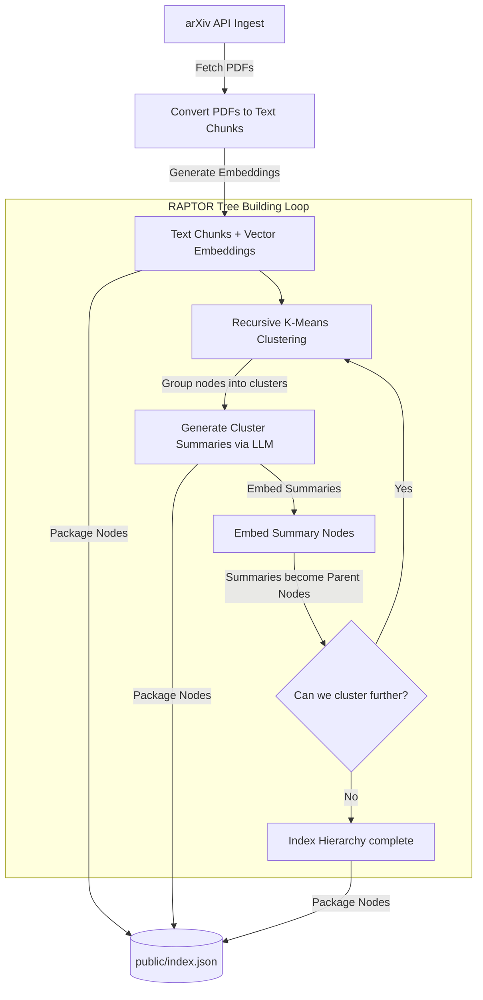
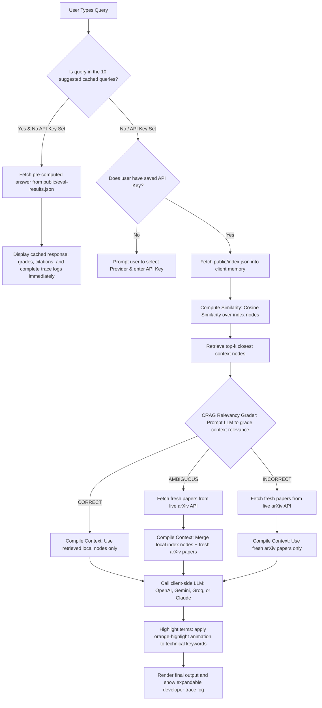

# Luminate AI — Comprehensive Architecture & Workflow Guide

Welcome to the engineering guide for **Luminate AI**. This document provides an in-depth, end-to-end breakdown of how the research assistant operates, details the role of every file in the project, and illustrates the system's workflows using Mermaid flow diagrams.

---

## 1. High-Level Core Concepts

Luminate AI is designed to solve two fundamental issues in standard Retrieval-Augmented Generation (RAG):
1. **Context Fragmentation**: Standard RAG chunks papers into tiny pieces. If a query asks for a high-level summary or spans multiple papers, flat chunk retrieval fails because it retrieves disconnected text snippets.
   * *Solution*: **RAPTOR** constructs a tree-like index by recursively clustering similar chunks and summarizing them, preserving both macro-level themes and micro-level facts.
2. **Static Knowledge Cutoff / Hallucination**: RAG is limited to the documents built into its index. If a user queries recent topics not inside the index, standard RAG hallucinates or fails.
   * *Solution*: **Corrective RAG (CRAG)** grades retrieved contexts. If the context is judged insufficient or irrelevant, it triggers an on-the-fly corrective search using the live **arXiv API** to inject fresh information.

Because Luminate AI is deployed as a static website on **GitHub Pages**, all computation (similarity searches, grading prompts, live arXiv queries, and final generation) is executed **client-side directly in the user's browser**.

---

## 2. Directory & File Walkthrough

Here is the purpose and location of every key file in the repository:

```
Self-Updating_RAG/
├── scripts/
│   ├── build-index.ts     # Offline indexing pipeline (Ingests arXiv PDFs, clusters, summarizes, embeds, and exports tree index)
│   ├── eval.ts            # Benchmarking script comparing baseline flat RAG vs. RAPTOR + CRAG on 10 evaluation queries
│   └── test-match.ts      # Diagnostic script to verify keyword search logic
├── src/
│   ├── app/
│   │   ├── page.tsx       # Core frontend dashboard: runs the client-side RAG loop, manages API states, and displays trace logs
│   │   ├── layout.tsx     # Next.js global layout definition
│   │   └── api/ask/       # Next.js Serverless API route (used optionally for server-based processing)
│   └── lib/
│       ├── retrieve.ts    # Client-safe cosine similarity vector matching and TF-IDF fallback search logic
│       └── grade.ts       # CRAG evaluator that grades retrieved document relevance and triggers live arXiv queries
├── public/
│   ├── index.json         # The exported static tree-index containing chunks, summaries, and vector embeddings
│   ├── eval-results.json  # Pre-computed answers and step-by-step developer traces for the 10 evaluation queries
│   └── .nojekyll          # Direct signal to GitHub Pages to serve Next.js underscore directories (like _next/static)
├── next.config.ts         # Handles basePath, assetPrefix, and static export configurations
├── package.json           # Manifest of Node dependencies and build scripts
└── tsconfig.json          # TypeScript compilation settings
```

---

## 3. Workflow Diagrams

### Workflow A: The Offline Indexing Pipeline (`scripts/build-index.ts`)
This pipeline runs once on the developer's machine. It ingests arXiv papers, builds the tree structure, and outputs a single static JSON index file containing all chunks, hierarchical summaries, and embeddings.



---

### Workflow B: The Online Client-Side RAG Loop (`src/app/page.tsx`)
This is the core execution loop running client-side inside the user's browser. It handles user input, performs local vector search, runs corrective relevance grading, performs optional live web search, and calls the selected LLM.



---

## 4. Deep-Dive Code Explanations

### 1. Ingestion and RAPTOR Tree Building (`scripts/build-index.ts`)
* **Embedding Model**: Uses OpenAI `text-embedding-3-small` (1536 dimensions).
* **Clustering**: Employs K-Means clustering. Because a document can belong to multiple categories, clustering allows overlapping memberships.
* **Hierarchical Summarization**:
  - The leaf nodes (original text chunks) are grouped into clusters.
  - The model calls `gpt-4o-mini` to summarize each cluster's content.
  - The summaries are embedded and added to the node list as "Parent Nodes".
  - This process runs recursively, creating a multi-layered hierarchical tree index exported to `public/index.json`.

### 2. Client-Side Retrieval (`src/lib/retrieve.ts`)
* **Cosine Similarity Matcher**:
  - When the user selects OpenAI as their provider, the system embeds the query using the OpenAI embedding API and performs a cosine similarity search against all vector embeddings in `public/index.json`.
* **TF-IDF Fallback Matcher**:
  - If the user selects Gemini, Groq, or Claude, the system falls back to a custom client-side TF-IDF similarity matcher. This ensures users do not need an OpenAI API key when choosing other LLM providers.
* **Node Selection**: The top $k$ nodes (combining leaf chunks and parent summaries) are selected as context.

### 3. Relevance Grading and Live Search (`src/lib/grade.ts`)
* **Relevance Grader**: The system asks the LLM to output a JSON object evaluating whether the retrieved context contains sufficient information to answer the user query.
* **Corrective Trigger**:
  - **`CORRECT`**: Context is sufficient.
  - **`INCORRECT`**: Context is useless. The local search nodes are discarded, and an arXiv search query is generated.
  - **`AMBIGUOUS`**: Context is partially useful. The local nodes are retained, but augmented with fresh results.
* **arXiv API Fallback**:
  - The system constructs a query string, hits `https://export.arxiv.org/api/query`, parses the returned XML in the browser, extracts relevant paper segments, and appends them to the context.

### 4. Frontend Controller (`src/app/page.tsx`)
* **State Management**: Manages API keys, chosen providers, current query state, loading indicators, active outputs, and collapsed developer logs.
* **Offline Caching**: Contains pre-bundled assets for the 10 evaluation queries in `public/eval-results.json`. Clicking a cached query provides a latency-free showcase of the system's reasoning logs and answers.
* **Highlight Render**: Employs custom CSS animations to highlight technical terms in the generated response. It wraps keywords in styled nodes to visualize concepts clearly.

---

## 5. Deployment Setup Details

### Next.js Static Export Configuration (`next.config.ts`)
To deploy a Next.js application to GitHub Pages:
1. `output: 'export'` turns off server-side rendering, packaging the application into static HTML, CSS, and Javascript.
2. `basePath: '/LuminateAI'` and `assetPrefix: '/LuminateAI/'` ensure that all paths point to the repository name on GitHub Pages (`https://<username>.github.io/LuminateAI/`).
3. We dynamically toggle this prefix off during local development (`http://localhost:3000`), allowing developers to test locally without changing URLs.
4. `.nojekyll` in the root of the deployment prevents GitHub from ignoring folders beginning with an underscore (such as Next.js's native `_next` folder).
