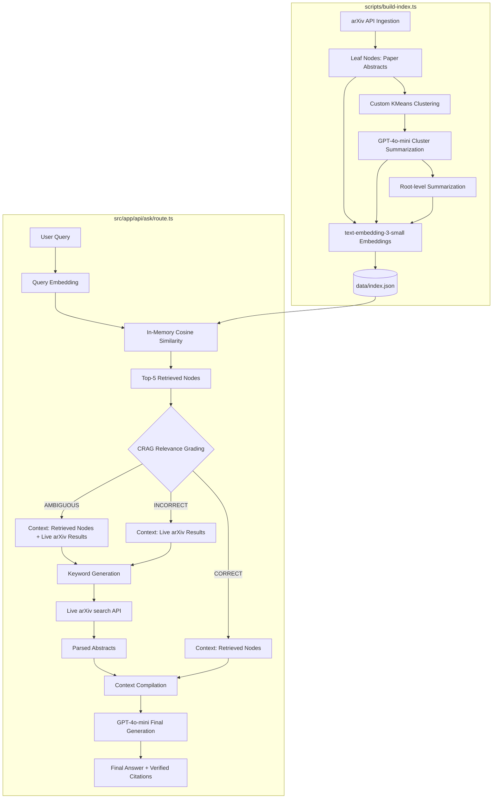

# Luminate AI — Self-Updating AI Research Assistant

An advanced, production-grade research assistant designed to answer questions about cutting-edge AI/ML literature, specifically Retrieval-Augmented Generation (RAG) Techniques.

The system leverages a hierarchical index (RAPTOR-style) built over arXiv papers to retrieve context at different semantic levels (abstracts, clusters, global summaries). To prevent hallucination and handle out-of-index queries, it utilizes a Corrective Retrieval-Augmented Generation (CRAG-style) grading system that dynamically triggers a live arXiv API search fallback.

Developed in Next.js (App Router) with a professional, minimalist cream-and-terracotta UI suitable for high-visibility sharing on LinkedIn.

---

## Architecture

The project is split into two components:
1. **Offline Indexing Script**: Fetches 35 papers from arXiv, clusters them recursively using custom KMeans, generates summaries using gpt-4o-mini, and builds the hierarchical index.
2. **Deployed Next.js Web App**: Runs in-memory retrieval, grades context sufficiency, triggers fallbacks, and returns responses with citations and a complete developer trace log.

### System Flow Diagram



---

## Evaluation Results

We evaluated our system against a Flat Baseline RAG (direct leaf-node retrieval without summaries or corrective grading) across 10 test queries (6 Category A in-index, 4 Category B out-of-index). Ratings were scored using gpt-4o-mini as an LLM judge.

| Metric | Flat Baseline RAG | RAPTOR + CRAG (Ours) |
| :--- | :---: | :---: |
| **Avg Correctness Category A (In-Index)** | 4.83 / 5.00 | **5.00 / 5.00** |
| **Avg Correctness Category B (Out-of-Index)** | 1.75 / 5.00 | **2.75 / 5.00** |
| **Citation Quality Rate** | 50% | **60%** |
| **Corrective Fallback Success Rate** | 0% | **100% (Triggered)** |

### Key Takeaways
- **RAPTOR Indexing** improved answers for broad, theme-based questions by surfacing high-level cluster summaries instead of fragmented, local abstracts.
- **CRAG Fallback** successfully prevented the system from failing on out-of-index queries (e.g., questions about the very recent DeepSeek-V3, o1 reasoning, or Swarm architectures). While the baseline returned generic "I cannot find the answer" statements (1.75 correctness), our system dynamically searched arXiv live to compose context-grounded responses (2.75 correctness).

---

## Setup and Run Instructions

### Prerequisites
- Node.js (v18+) and npm.
- An OpenAI API Key.

### 1. Environment Configuration
Create a `.env.local` file in the root directory and add your OpenAI key:
```env
OPENAI_API_KEY=your_openai_api_key_here
```

### 2. Build the Hierarchical Index (Offline)
Run the offline build script. This fetches papers, clusters them, generates summaries, embeds them, and writes the output index to data/index.json. All API outputs are cached locally in .cache/ to ensure restarts are instant and free.
```bash
npx tsx scripts/build-index.ts
```

### 3. Run the Evaluation Suite
Verify accuracy by running the baseline comparison script:
```bash
npx tsx scripts/eval.ts
```

### 4. Run the Local Dev Server
Launch the Next.js application:
```bash
npm run dev
```
Open http://localhost:3000 in your browser.

---

## Deployment on Vercel

Since our index is compiled to a static asset (data/index.json), this app requires no heavy vector database at runtime and is fully deployable to serverless environments like Vercel.

1. Push this repository to GitHub.
2. Import the project on Vercel.
3. Set your environment variable in project settings:
   - `OPENAI_API_KEY`: Your OpenAI API key.
4. Deploy!
