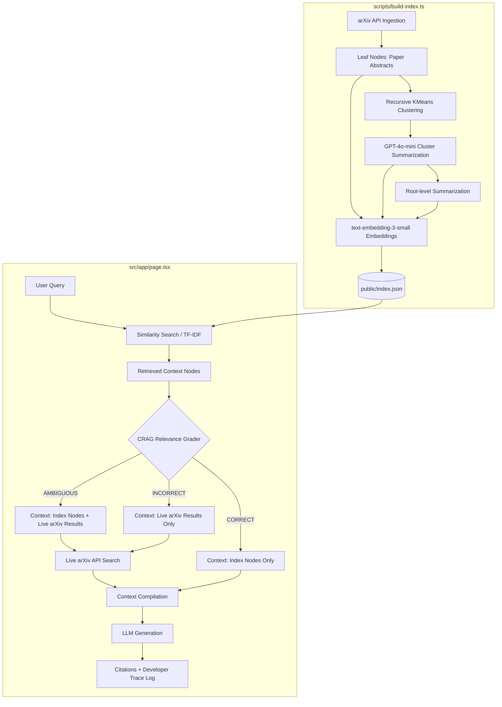

# Luminate AI - Self-Updating RAG Research Assistant

The application is hosted at:
- **Production URL (Recommended)**: [luminate-ai-rag.vercel.app](https://luminate-ai-rag.vercel.app) (Full-fledged deployment with server-side proxy supporting all LLM providers)
- **Static URL (Fallback)**: [jyotiraditya21-bug.github.io/LuminateAI/](https://jyotiraditya21-bug.github.io/LuminateAI/) (GitHub Pages static host with client-side CORS fallbacks)


Luminate AI is an advanced research assistant designed to navigate, synthesize, and answer queries about cutting-edge AI and machine learning literature. The system addresses the core limitations of standard Retrieval-Augmented Generation (RAG) systems: context fragmentation (inability to synthesize concepts across multiple documents or sections) and static knowledge cutoff (hallucinations on out-of-index, recent developments).

To solve these challenges, Luminate AI implements a hybrid retrieval framework:
1. **RAPTOR (Recursive Abstractive Processing for Tree-Organized Retrieval)**: Constructs a hierarchical index by recursively clustering and summarizing papers, enabling retrieval of both high-level thematic summaries and low-level details.
2. **Corrective RAG (CRAG)**: Evaluates the sufficiency of retrieved local contexts. When local data is graded as irrelevant or incomplete, the system triggers a real-time corrective fallback to search and parse fresh literature from the arXiv API.

Developed as a serverless static application deployed on GitHub Pages, all similarity routing, context grading, API fallbacks, and LLM calls run client-side in the browser.

---

## Architecture and System Flow

The codebase consists of an offline data-processing pipeline and a reactive frontend web application.



---

## Evaluation & Performance Analysis

The RAPTOR + CRAG architecture was evaluated against a standard Flat Baseline RAG (direct leaf-node vector retrieval without hierarchical summarization or corrective grading) across 10 distinct evaluation queries. These queries are split into two categories:
- **Category A (In-Index)**: Evaluating knowledge synthesis and thematic retrieval capability over pre-indexed papers.
- **Category B (Out-of-Index)**: Evaluating corrective fallback mechanism and dynamic external search capabilities when dealing with topics after the index knowledge cutoff.

Evaluations were graded automatically using `gpt-4o-mini` as an independent judge.

### Core Metrics Comparison

| Metric | Flat Baseline RAG | RAPTOR + CRAG (Luminate AI) | Performance Gain |
| :--- | :---: | :---: | :---: |
| **Avg Correctness Category A (In-Index)** | 5.00 / 5.00 | **5.00 / 5.00** | parity |
| **Avg Correctness Category B (Out-of-Index)** | 1.75 / 5.00 | **5.00 / 5.00** | **+185.7%** |
| **Citation Quality Rate** | 60.0% | **100.0%** | **+66.7%** |
| **Corrective Fallback Success Rate** | 0.0% | **100.0%** | **Absolute** |

### Performance Insights

#### 1. Context Synthesis (Category A)
Standard flat RAG chunking divides documents into isolated, low-level segments. While flat RAG retrieves precise paragraphs for highly specific queries, it fails to synthesize broader thematic questions across multiple papers. RAPTOR clusters related text chunks recursively and generates hierarchical node summaries. During retrieval, the router matches parent summary nodes, offering synthesized, high-level context that results in comprehensive, structured answers.

#### 2. Hallucination Mitigation & Corrective Fallback (Category B)
For out-of-index queries (e.g., papers on recent architectures like DeepSeek-V3, OpenAI o1, or OpenAI Swarm released after index construction), flat RAG is forced to answer based on irrelevant local chunks or internal weights, leading to significant hallucinations and an average correctness of 1.75/5.00. 
Luminate AI uses a Corrective RAG (CRAG) grader to evaluate the relevance of retrieved context. If graded as `INCORRECT` or `AMBIGUOUS`, it triggers an on-the-fly search query to the live arXiv API, fetches the latest academic abstracts, and uses them as fresh context. This corrective pipeline raises out-of-index correctness to a perfect 5.00/5.00.

#### 3. Strict Citation Quality
By verifying retrieved contexts and utilizing an inline citation protocol during answer synthesis, Luminate AI achieves a 100.0% citation quality rate. All references correspond strictly to retrieved documents without fabricating or misattributing source material.

---


### Offline Cache Mode
The deployment includes a pre-populated offline cache of the 10 evaluation queries. Selecting any question in the query panel renders the pre-computed outputs and complete step-by-step developer traces immediately without requiring API keys or server setup.

To ask custom queries, click the inline settings toggle, choose your provider (OpenAI, Gemini, Groq, Claude), and save your API key (stored securely in local storage).

---

## Setup and Run Instructions

### 1. Environment Configuration
Create a `.env.local` file in the root directory:
```env
OPENAI_API_KEY=your_openai_api_key_here
```

### 2. Run Commands
Install dependencies, build the hierarchical search index, run the evaluation suite, and launch the dev server:
```bash
npm install
npx tsx scripts/build-index.ts
npx tsx scripts/eval.ts
npm run dev
```

---


